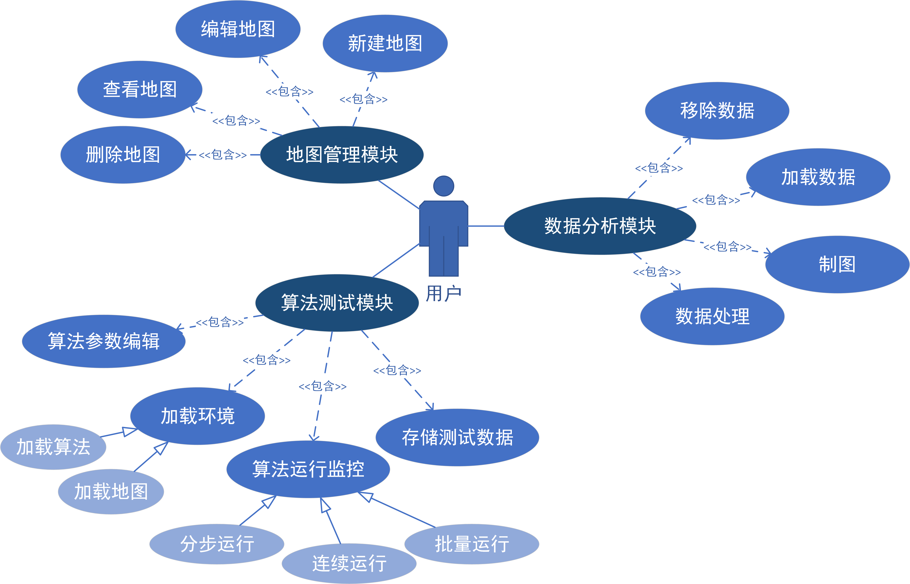
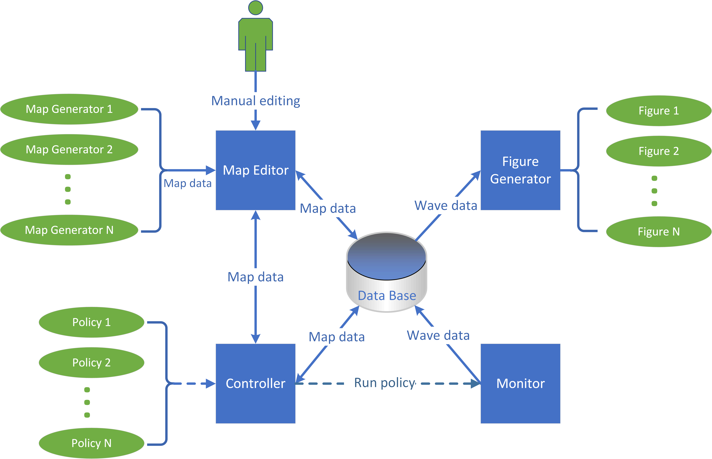

# RL_Platform-CrossTheWall

## change log

- v1.0 （2021/7/17 15:44）
  - 首次提交
- v1.1 （2021/10/11 22:50）
  - 修正了加载文件bug
  - 修正了内置 DynaQ 和 DynaQPrior 算法的bug
  - MapEditor 中，新增画笔编辑功能
  - MapEditor 中，现在支持设置多个起点、终点
  - Controller中，新增UI显示周期控制功能
  - 修改了 map 文件存储格式
  - 新增任务：GridMaze

----


## 1. 概述

- 本系统是一种全流程可视化的 Grid World 虚拟环境。主要功能包括地图编辑、算法测试、数据分析制图三项，允许用户完成强化学习、模仿学习等领域算法的运行测试及性能对比分析的完整流程，所有操作都可使用UI控制，脱离代码编写过程

- 本系统自带两个强化学习任务 

  1. `Cross The Wall`：类似游戏 flappy bird，agent以 1 的速度匀速右移，控制其上下移动速度，穿过若干墙壁到达终点
  2.  `GridMaze`：传统的 Grid World 控制任务，控制 agent 上下左右移动以到达终点 

  它们都是基于 Grid World 环境的控制任务，用于测试算法性能。测试任务也可以简单地修改成其他基于 Grid World 环境的控制任务，**目前本系统仅支持离散环境**

  

## 2. 系统设计

### 2.1 用例设计



### 2.1.1 地图管理模块

- 本模块实现地图的增删查改操作。具体功能如下：
  1. **新建地图**：用户提供地图尺寸，生成相应大小的矩形空白地图，或利用内置的地图生成器直接生成符合特定任务要求的地图，然后模块即进入查看地图状态。由于地图生成器只能通过修改源代码进行添加，而用户可能需要根据其特殊任务生成相应地图，因此模块编写时注意扩展性。
  2. **查看地图**：用户可以直接获取当前算法测试模块中进行测试的地图，或从本地加载曾经保存的地图进行查看。处于查看状态的地图可以进行编辑，也可转移至算法测试模块进行测试，或持久化保存至本地，存储形式为 `.txt` 文件。
  3. **编辑地图**：地图编辑粒度为单个方格，可以编辑的方格属性包括附带奖励值、起点标记、终点标记、允许通行标记等。也可把某个方格的属性存为“画笔”，类似word中的格式刷，按住鼠标拖动就可以快速把大量方格修改为相同属性；又类似像素画编辑器，画笔带有颜色，绘制过属性的方格通过颜色和其他方格区分。
  4. **删除地图**：地图以.txt文件形式存储于本地，用户可以使用此功能删除地图对应的文本文件（此功能未开发）

### 2.1.2 算法测试模块

- 本模块实现算法运行监控，允许用户实时查看环境和智能体的各类数据、实时调整算法超参数，算法运行数据也可以通过此模块保存至本地。具体功能如下：
  1. **加载环境**：包含加载地图和加载算法两部分，地图可以从地图管理模块或本地加载，算法则是模块中内置的。由于策略只能通过修改源代码进行添加，因此模块编写时要注意扩展性。
  2. **算法运行监控**：强化学习算法通常是一个迭代过程，在迭代中逐步预测环境状态价值、优化智能体策略。监控功能包含分步运行、连续运行、批量运行三部分，供用户观察不同粒度下的环境及智能体变化。可观测数据包括状态价值 $V(s)$、状态动作价值 $Q(s,a)$、智能体策略 $\pi$ 等，还可以在内置Monitor中实时查看轨迹长度、轨迹收益折线图。强化学习算法运行耗时很长，此功能在子线程运行算法，在主线程刷新UI。
  3. **算法参数编辑**：用户通过此功能在算法运行时实时编辑算法超参数，包括学习率 $\alpha$、折扣系数 $\gamma$、 $\epsilon$-贪心中的随机概率 $\epsilon$ 等。
  4. **存储测试数据**：测试数据包括轨迹长度数据、轨迹收益数据两种，可以在内置 Monitor 组件中选择持久化保存至本地，存储形式为 `.bin` 文件。

### 2.1.3 数据分析模块

- 本模块实现测试数据（包括轨迹长度数据及轨迹收益数据）的对比分析，允许用户加载多次试验的测试数据绘制在同一张折线图中，并能一键生成 matplotlib 形式的 Figure 图像。由于强化学习算法中通常带有随机成分，算法测试模块中记录的原始数据往往含有高频噪声，故此模块还提供滑动滤波功能，可以对数据进行简单处理。具体功能如下：
  1. **加载数据**：用户通过此功能加载算法测试模块中保存到本地的算法测试数据，加载后的数据会暂存于工作区，只有工作区中的数据可以可选地绘制于折线图上。
  2. **移除数据**：用户通过此功能把测试数据从工作区移除
  3. **制图**：用户使用此功能从工作区中选择任意数量数据显示于折线图上，还可实时调整不同数据对应折线的颜色，以便用户对比不同算法的性能。调整完毕后，可以一键生成 matplotlib 形式的 Figure 图像。
  4. **数据处理**：用户通过此功能对数据进行滤波处理，处理后的折线正常显示，而含高频噪声的原始数据会变为半透明。用户可以实时调整滑动滤波的buffer长度及原始数据透明度。


## 2.2 架构设计




- 根据功能分解设计，本系统围绕以下四个核心组件开发：
  1. **Map Editor**：地图管理模块核心组件，实现地图的图形化编辑、新建、保存。
  2. **Controller**：算法测试模块核心组件，提供算法测试的图形化界面，内置多种强化学习、模仿学习算法，允许用户加载算法和地图进行测试。
  3. **Monitor**：算法测试模块核心组件，实现算法测试数据收集和实时显示，并提供数据保存功能。
  4. **Figure Generator**：数据分析模块核心组件，允许用户加载多条测试数据并绘制到同一张折线图上，提供简单的图表编辑和数据处理功能。

- 地图数据（map data）和算法测试数据（wave data）是本系统的两种核心数据，它们在本地存储和上述四个核心组件之间相互传递。


## 3. 使用说明

- 安装以下依赖库
  - `pyqt5`
  - `pyqtgraph`
  - `numpy`
  - `matplotlib`

- 使用 vscode IDE，编辑setting文件，设置源码路径（或者直接使用本项目中的 setting 文件）

  ```json
  {
      "python.linting.pylintEnabled": true,
      "python.linting.enabled": false,
      "python.autoComplete.extraPaths": [
          "./core",
          "./core/MapGenerator",
          "./core/CustomWidgets",
          "./core/Util",
          "./core/Policy"
      ],
      "python.analysis.extraPaths": [
          "./core",
          "./core/MapGenerator",
          "./core/CustomWidgets",
          "./core/Util",
          "./core/Policy"
      ]
  }
  ```

- 打开根目录中的 `main.py`，直接运行即可